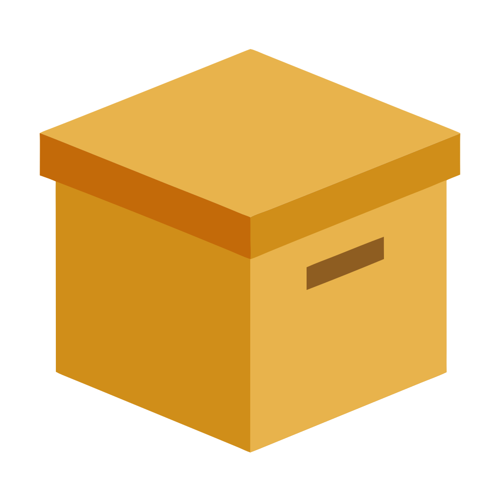

# tobox

`tobox` is a secure, high-performance, fault-tolerant decentralized object file storage written entirely in Rust.

The API is similar to [amazon s3](https://docs.aws.amazon.com/AmazonS3/latest/API/Welcome.html) but aims to be simpler.
